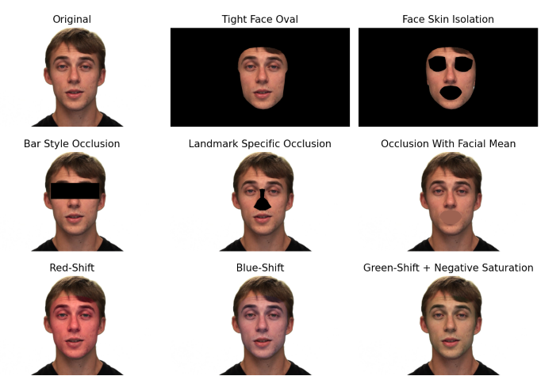
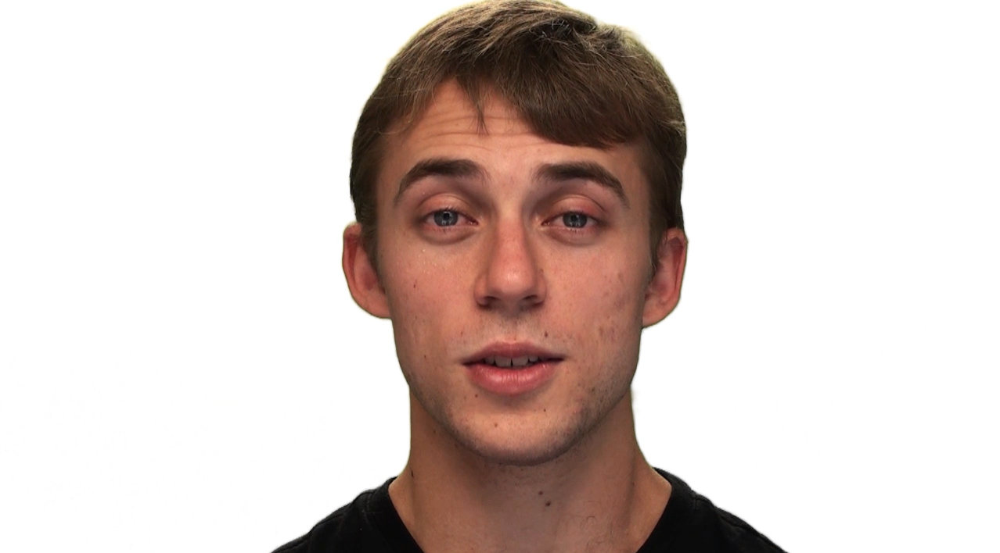
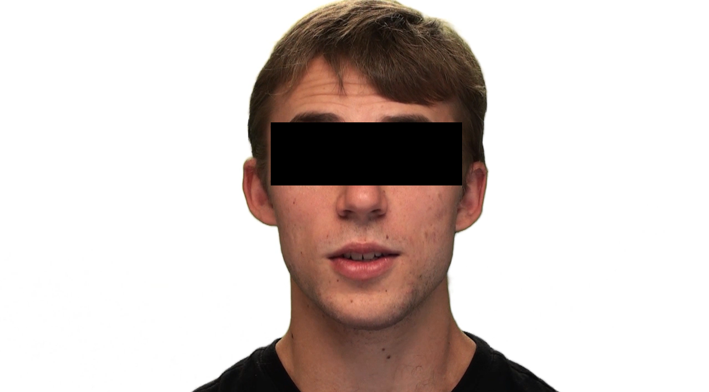

# PsyFace
PsyFace is a python package for dynamic region occlusion and skin colour modification of faces in video and images. Provides a range of tools for changing the colour of user-specified facial regions using industry-standard colour spaces (L*a*b, HSV, BGR), occlusion of user-defined facial regions (e.g., eyes, nose, mouth, hemi-face), and isolation of the head from background scene through video matting. Facial modifications can be further transitioned on and off through a range of timing functions (e.g., linear, sigmoid, Gaussian etc).

PsyFace enables researchers to apply complex facial manipulations to just the face in dynamic video and still images scenes in several lines of code.
Here is an example of PsyFace performing pixel-level modifications to create new videos from the original one:



## Statement of Need

Currently, there are no available tools for performing these types of pixel-level operations over videos. Existing research has commonly used general image editing tools (such as Photoshop). However, these tools apply changes to the entire image, causing noticeable background artifacts. PsyFace provides users the ability to selectively modify specific regions of the face, for both static images and videos. Our package also seamlessly integrates temporal functions into it's video processing, allowing users to specify how and when pixel-level operations will be applied.

## A Quick Example: Facial Occlusion
```
import PsyFace as pf

# For windows operating systems use "\\" to delimit your pathstrings
# For linux or macos use "/" to delimit your pathstrings
in_dir = ".\<your input directory>"
out_dir = ".\<your output directory>"

# Psyface provides an extensive list of predefined landmark paths, as well as several predefined occlusion types
pf.occlude_face_region(input_dir = in_dir, output_dir = out_dir, landmarks_to_occlude = [LEFT_EYE_PATH, RIGHT_EYE_PATH], occlusion_fill = OCCLUSION_FILL_BAR)
```

### Before


### After


## Underlying Model

MediaPipe's Face Mesh task provides automated detection of 468 unique facial landmarks. By accessing the x-y screen coordinates of these landmarks, many complex image and video operations can be performed. 

[](https://ai.google.dev/edge/mediapipe/solutions/vision/face_landmarker)

For more on mediapipe, see [here](https://ai.google.dev/edge/mediapipe/solutions/guide)

## Documentation and Changelog

This project maintains a changelog, following the format of [keep a changelog](https://keepachangelog.com/en/1.0.0/). This project also adheres to [semantic versioning](https://semver.org/spec/v2.0.0.html).

To view our documentation, examples and tutorials, see [PsyFace Docs](https://gavin-bosman-psyface.readthedocs.io/en/latest/).

## Contributing

PsyFace is a young project, and it is still far from perfect! If you have any ideas on how to improve the package please submit an inquiry and we will work on implementing it right away!

Pull requests are always welcome. If you spot a mistake, error, or inefficiency within the source code, let us know!

## License

[MIT](https://opensource.org/license/mit)
