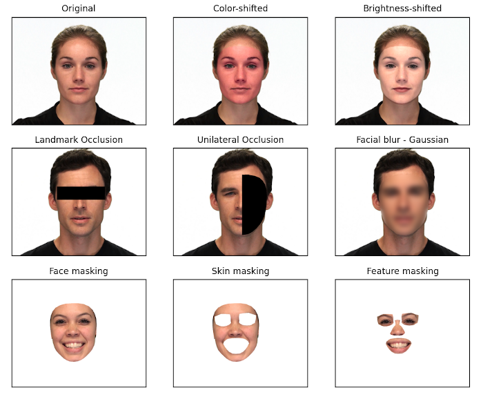

---
hide:
  - navigation
  - toc
---

  <h1 markdown>PsyFace</h1>
  [View On Github :simple-github:](https://github.com/Gavin-Bosman/PsyFace){ .md-button .md-button--primary }
  [Open Documentation :material-book:](./reference.md){.md-button }

- __Overview__ 

    ***

    PsyFace is a python package for dynamic *facial occlusion* and *facial color manipulation* in both still images and videos. PsyFace provides a range of tools for manipulating color in user-specified facial regions using industry-standard color spaces (1) (RGB, BGR, HSV, CIELAB), as well as dynamic facial occlusion of user-specified facial regions, and facial (as well as individual facial regions) isolation from the background using video matting.
    {.annotate}

    PsyFace was designed with ease of processing in mind. Each of the core package functions can process entire directories of mixed image and video files, with or without nested directories, from a single function call. Uniquely, PsyFace provides access to temporal color manipulation over videos. Users can chooses from a variety of predefined timing functions (2) or choose to define their own. 
    {.annotate}

    1. :material-lightbulb-on: For more information on color spaces check out [Cambridge in Color.](https://www.cambridgeincolour.com/tutorials/color-spaces.htm) 
    2. :material-lightbulb-on: PsyFace provides predefined function definitions for linear, sigmoid, gaussian and sinusoidal functions.
    
- __Function Outputs__

    ***

    {align=right}

